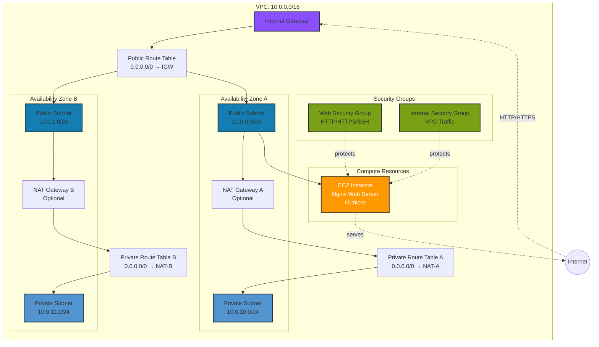
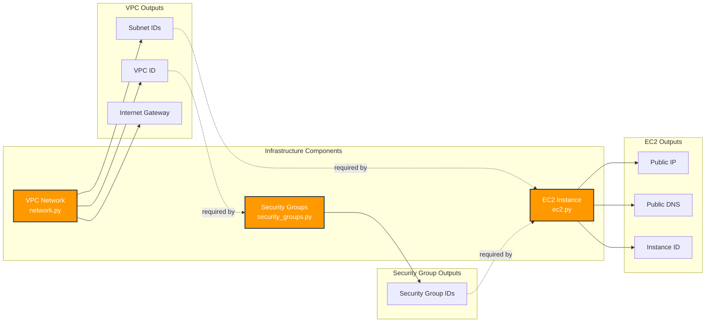
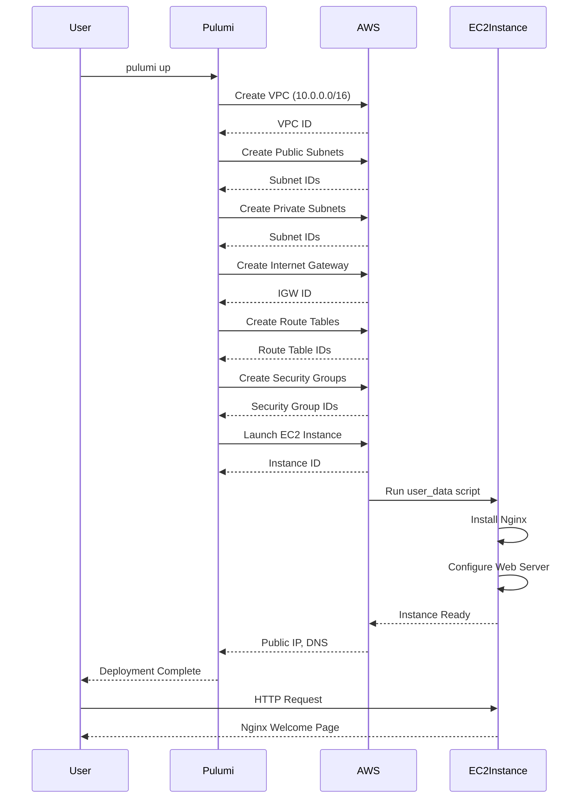
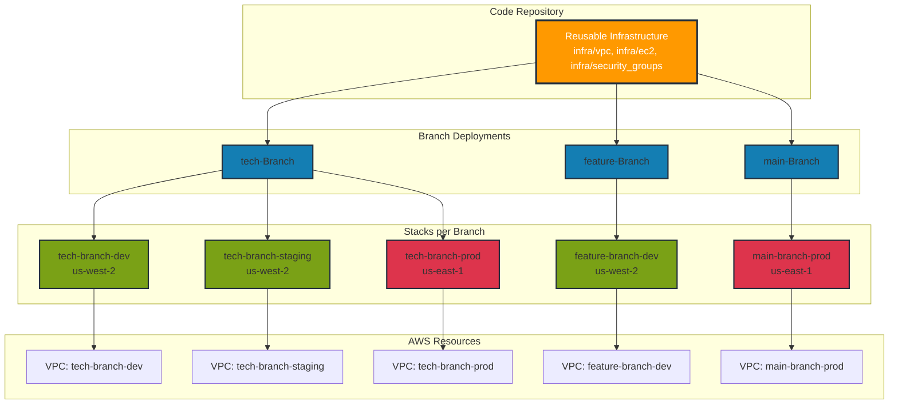
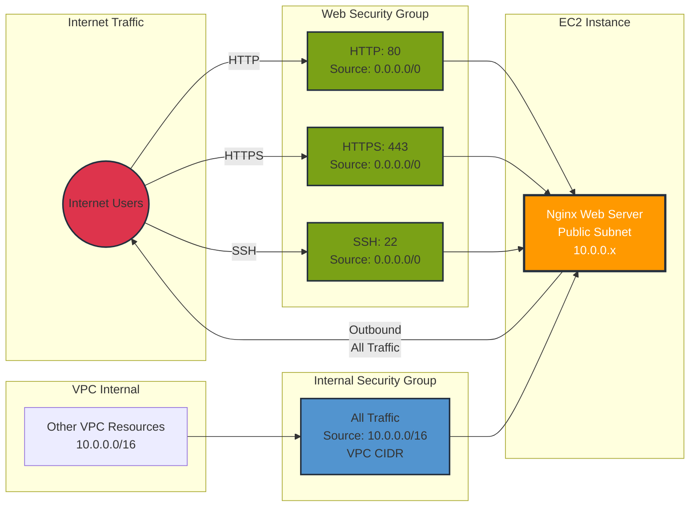

# Infrastructure Deployment Guide

This guide explains how to deploy the networking, security groups, and EC2 infrastructure across different branches/environments.

## Table of Contents
- [Architecture Overview](#architecture-overview)
- [Prerequisites](#prerequisites)
- [Project Structure](#project-structure)
- [Infrastructure Components](#infrastructure-components)
- [Deployment Steps](#deployment-steps)
- [Multi-Branch Deployment](#multi-branch-deployment)
- [Configuration Management](#configuration-management)
- [Outputs and Verification](#outputs-and-verification)
- [Cleanup](#cleanup)

---

## Architecture Overview

The infrastructure consists of three main components:

1. **VPC Network** (`infra/vpc/network.py`)
   - VPC with configurable CIDR
   - Public and private subnets across multiple AZs
   - Internet Gateway
   - NAT Gateways (optional)
   - Route tables and associations
   - IP prefix lists

2. **Security Groups** (`infra/security_groups/security_groups.py`)
   - Base SecurityGroup class for custom rules
   - WebSecurityGroup for HTTP/HTTPS/SSH
   - DatabaseSecurityGroup for databases
   - ApplicationSecurityGroup for app servers
   - LoadBalancerSecurityGroup for load balancers

3. **EC2 Instances** (`infra/ec2/ec2.py`)
   - Configurable instance type
   - Auto-selects latest Amazon Linux 2023 AMI
   - User data support for bootstrapping
   - Security group integration
   - Public/private subnet placement

### Infrastructure Architecture Diagram



### Component Relationship Diagram



### Deployment Workflow



### Multi-Branch Deployment Strategy



### Security Group Traffic Flow



---

## Prerequisites

### 1. Environment Setup
```bash
# Ensure Pulumi is installed
pulumi version  # Should show v3.218.0 or later

# Ensure AWS CLI is configured
aws configure list

# Activate Python virtual environment
cd /workspaces/dev-container-python/pulumi-python-projects
source venv/bin/activate

# Install dependencies
pip install -r ec2/requirements.txt  # or your specific requirements file
```

### 2. Required Tools
- Pulumi CLI (v3.218.0+)
- Python 3.9+
- AWS CLI configured with credentials
- Git (for version control)

### 3. AWS Permissions Required
- EC2 (VPC, Subnets, Security Groups, Instances)
- IAM (for AWS profile)
- Optional: S3 (if using S3 backend)

---

## Project Structure

```
pulumi-python-projects/
├── infra/                          # Reusable infrastructure components
│   ├── vpc/
│   │   └── network.py             # VPC networking class
│   ├── security_groups/
│   │   └── security_groups.py     # Security group classes
│   └── ec2/
│       └── ec2.py                 # EC2 instance class
│
├── branch/                         # Branch-specific deployments
│   └── tech-Branch/
│       ├── __main__.py            # Main deployment file
│       ├── Pulumi.yaml            # Project configuration
│       ├── Pulumi.dev.yaml        # Dev stack configuration
│       └── requirements.txt       # Dependencies
│
└── venv/                          # Python virtual environment
```

---

## Infrastructure Components

### VPC Network Component

**File:** `infra/vpc/network.py`

**Features:**
- Creates VPC with custom CIDR block
- Public subnets with auto-assign public IPs
- Private subnets for internal resources
- Internet Gateway for public internet access
- NAT Gateways for private subnet internet (optional)
- Route tables with proper routing
- IP prefix lists for IP management

**Configuration:**
```python
network = VpcNetwork(
    "my-network",
    args={
        "cidr_block": "10.0.0.0/16",
        "availability_zones": ["us-west-2a", "us-west-2b"],
        "enable_nat_gateway": False,
        "enable_dns_hostnames": True,
        "tags": {"Environment": "dev"},
    },
)
```

### Security Groups Component

**File:** `infra/security_groups/security_groups.py`

**Classes Available:**

1. **SecurityGroup** - Base class with custom rules
2. **WebSecurityGroup** - HTTP (80), HTTPS (443), SSH (22)
3. **DatabaseSecurityGroup** - MySQL, PostgreSQL, Redis, etc.
4. **ApplicationSecurityGroup** - Custom app ports
5. **LoadBalancerSecurityGroup** - HTTP/HTTPS for ALB

**Configuration:**
```python
web_sg = WebSecurityGroup(
    "web-sg",
    args={
        "vpc_id": network.vpc.id,
        "allow_ssh": True,
        "ssh_cidr_blocks": ["0.0.0.0/0"],
        "tags": {"Tier": "web"},
    },
)
```

### EC2 Instance Component

**File:** `infra/ec2/ec2.py`

**Features:**
- Auto-selects latest Amazon Linux 2023 AMI
- Configurable instance type
- User data support for bootstrapping
- Multiple security group support
- Public or private subnet placement

**Configuration:**
```python
web_server = Ec2Instance(
    "web-server",
    args={
        "instance_type": "t3.micro",
        "subnet_id": network.public_subnets[0].id,
        "security_group_ids": [web_sg.security_group.id],
        "user_data": nginx_script,
        "key_name": "my-key-pair",
        "tags": {"Role": "web"},
    },
)
```

---

## Deployment Steps

### Step 1: Setup Environment Variables

```bash
# Set Pulumi environment
export PATH=$PATH:/home/vscode/.pulumi/bin
export PULUMI_CONFIG_PASSPHRASE="your-secure-passphrase"

# Activate virtual environment
cd /workspaces/dev-container-python/pulumi-python-projects
source venv/bin/activate
```

### Step 2: Navigate to Deployment Directory

```bash
cd branch/tech-Branch
```

### Step 3: Initialize Pulumi Stack

```bash
# Login to Pulumi (local backend)
pulumi login --local

# Create a new stack or select existing
pulumi stack init dev
# OR
pulumi stack select dev
```

### Step 4: Configure Stack

```bash
# Set AWS region
pulumi config set aws:region us-west-2

# Set AWS profile (optional)
pulumi config set aws:profile default

# Set custom configurations
pulumi config set env dev
pulumi config set branch tech-branch
pulumi config set ec2:instanceType t3.micro

# Optional: Set SSH key name
pulumi config set keyName your-key-pair-name
```

### Step 5: Preview Deployment

```bash
# Preview what will be created
pulumi preview
```

**Expected Resources:**
- 1 VPC
- 2 Public Subnets
- 2 Private Subnets
- 1 Internet Gateway
- 3 Route Tables
- 2 Security Groups
- 1 EC2 Instance
- ~15-20 total resources

### Step 6: Deploy Infrastructure

```bash
# Deploy the infrastructure
pulumi up

# Review the changes and type 'yes' to confirm
```

### Step 7: Verify Deployment

```bash
# Get outputs
pulumi stack output

# Get specific output
pulumi stack output web_server_public_ip
pulumi stack output vpc_id

# Test nginx server
curl http://$(pulumi stack output web_server_public_ip)
```

---

## Multi-Branch Deployment

### Deploying to Different Branches/Environments

The infrastructure supports deploying to multiple branches (dev, staging, production) using Pulumi stacks.

### Option 1: Using Different Stacks in Same Project

```bash
cd branch/tech-Branch

# Deploy to DEV
pulumi stack select dev
pulumi config set env dev
pulumi config set branch tech-branch
pulumi up

# Deploy to STAGING
pulumi stack init staging
pulumi config set env staging
pulumi config set branch tech-branch
pulumi config set aws:region us-west-2
pulumi up

# Deploy to PRODUCTION
pulumi stack init prod
pulumi config set env production
pulumi config set branch tech-branch
pulumi config set aws:region us-east-1
pulumi up
```

### Option 2: Separate Branch Directories

```bash
# Create deployment for another branch
mkdir -p branch/feature-Branch
cd branch/feature-Branch

# Copy configuration files
cp ../tech-Branch/Pulumi.yaml .
cp ../tech-Branch/__main__.py .
cp ../tech-Branch/requirements.txt .

# Update Pulumi.yaml
# Change: name: Tech-Branch -> name: Feature-Branch

# Initialize stack
pulumi login --local
pulumi stack init dev

# Configure
pulumi config set aws:region us-west-2
pulumi config set env dev
pulumi config set branch feature-branch
pulumi config set ec2:instanceType t3.micro

# Deploy
pulumi up
```

### Configuration File Per Stack

Each stack has its own configuration file: `Pulumi.<stack-name>.yaml`

**Example `Pulumi.dev.yaml`:**
```yaml
config:
  aws:region: us-west-2
  aws:profile: default
  env: dev
  branch: tech-branch
  ec2:instanceType: t3.micro
```

**Example `Pulumi.prod.yaml`:**
```yaml
config:
  aws:region: us-east-1
  aws:profile: production
  env: production
  branch: tech-branch
  ec2:instanceType: t3.large
```

---

## Configuration Management

### Stack-Specific Configuration

```bash
# View current configuration
pulumi config

# Set configuration values
pulumi config set <key> <value>

# Set secret values (encrypted)
pulumi config set --secret dbPassword mySecretPass123

# Get configuration value
pulumi config get env
```

### Environment Variables in Code

The `__main__.py` file reads configuration:

```python
config = pulumi.Config()
environment = config.get("env")
branch_name = config.get("branch")
instance_type = config.get("instanceType")
```

### Resource Naming Convention

All resources are named with the pattern: `{branch}-{environment}-{resource}`

Examples:
- `tech-branch-dev-network`
- `tech-branch-dev-web-sg`
- `tech-branch-dev-web-server`

This ensures resources from different branches/environments don't conflict.

---

## Outputs and Verification

### Available Outputs

```bash
# VPC Information
pulumi stack output vpc_id
pulumi stack output vpc_cidr
pulumi stack output internet_gateway_id

# Subnet Information
pulumi stack output public_subnet_ids
pulumi stack output private_subnet_ids

# Security Group Information
pulumi stack output web_security_group_id
pulumi stack output internal_security_group_id

# EC2 Information
pulumi stack output web_server_id
pulumi stack output web_server_public_ip
pulumi stack output web_server_public_dns
pulumi stack output web_server_private_ip

# SSH Command
pulumi stack output ssh_command
```

### Verification Steps

1. **Test Network Connectivity:**
   ```bash
   # Test HTTP access
   curl http://$(pulumi stack output web_server_public_ip)

   # Test SSH access (if key configured)
   ssh -i ~/.ssh/your-key.pem ec2-user@$(pulumi stack output web_server_public_ip)
   ```

2. **Verify in AWS Console:**
   - Navigate to EC2 Dashboard
   - Check VPC, Subnets, Security Groups, Instances
   - Verify tags match your branch/environment

3. **Check Resource Tags:**
   ```bash
   aws ec2 describe-instances \
     --filters "Name=tag:Environment,Values=dev" \
     --query 'Reservations[*].Instances[*].[InstanceId,Tags]'
   ```

---

## Cleanup

### Destroy Stack Resources

```bash
# Preview what will be destroyed
pulumi destroy --preview

# Destroy all resources
pulumi destroy

# Type 'yes' to confirm
```

### Remove Stack

```bash
# After destroying resources, remove the stack
pulumi stack rm dev

# Confirm by typing the stack name
```

### Clean Multiple Stacks

```bash
# List all stacks
pulumi stack ls

# Destroy each stack
pulumi stack select dev && pulumi destroy
pulumi stack select staging && pulumi destroy
pulumi stack select prod && pulumi destroy

# Remove all stacks
pulumi stack rm dev
pulumi stack rm staging
pulumi stack rm prod
```

---

## Troubleshooting

### Common Issues

1. **"backend does not support environments"**
   - Ensure `Pulumi.<stack>.yaml` doesn't have `environment:` key
   - Use `env:` under `config:` section instead

2. **"SecurityGroupIngressArgs unexpected keyword"**
   - Fixed in `infra/security_groups/security_groups.py`
   - Use `security_groups` instead of `source_security_group_id`

3. **Module import errors**
   - Ensure virtual environment is activated
   - Run `pip install -r requirements.txt`
   - Check `sys.path.insert()` in `__main__.py`

4. **AWS credential errors**
   - Run `aws configure` to set credentials
   - Check `pulumi config get aws:profile`
   - Verify IAM permissions

### Debug Commands

```bash
# Enable verbose logging
pulumi up --logtostderr -v=9

# Preview with detailed output
pulumi preview --diff

# Check state
pulumi stack export

# Refresh state from AWS
pulumi refresh
```

---

## Best Practices

1. **Use Stack Configurations**
   - Keep stack-specific configs in `Pulumi.<stack>.yaml`
   - Use secrets for sensitive data

2. **Resource Naming**
   - Follow naming convention: `{branch}-{environment}-{resource}`
   - Use descriptive tags

3. **Security**
   - Restrict SSH access to specific IPs (not 0.0.0.0/0)
   - Use private subnets for sensitive resources
   - Rotate access keys regularly

4. **State Management**
   - Use Pulumi Cloud or S3 backend for team collaboration
   - Regular state backups with `pulumi stack export`

5. **Cost Optimization**
   - Disable NAT Gateways in dev environments
   - Use smaller instance types for testing
   - Clean up unused stacks

---

## Quick Reference

### Deploy New Environment
```bash
cd branch/tech-Branch
export PULUMI_CONFIG_PASSPHRASE="your-pass"
pulumi stack init <env>
pulumi config set aws:region us-west-2
pulumi config set env <env>
pulumi config set branch tech-branch
pulumi up
```

### Update Existing Environment
```bash
cd branch/tech-Branch
pulumi stack select <env>
# Make code changes
pulumi up
```

### Destroy Environment
```bash
cd branch/tech-Branch
pulumi stack select <env>
pulumi destroy
```

---

## Support

For issues or questions:
- Check Pulumi documentation: https://www.pulumi.com/docs/
- Review AWS documentation: https://docs.aws.amazon.com/
- Check project GitHub issues

---

**Last Updated:** 2026-02-02
**Infrastructure Version:** 1.0.0
**Pulumi Version:** 3.218.0
