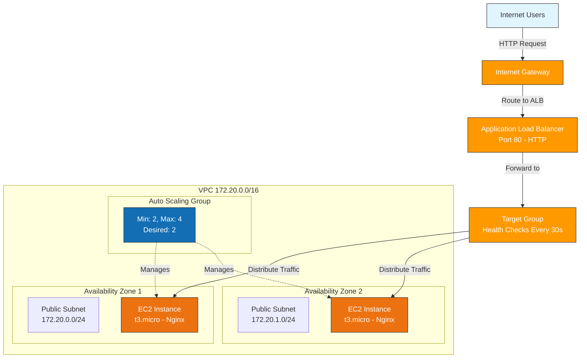
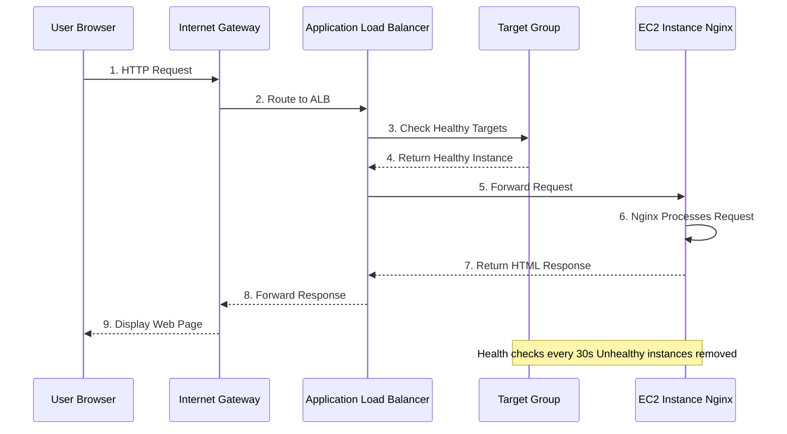
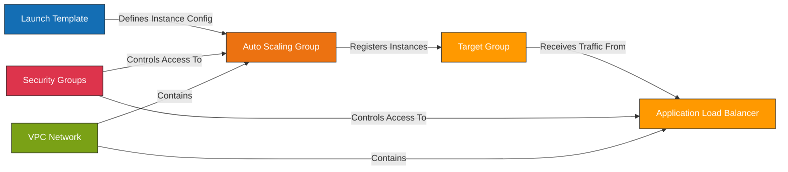

# Infrastructure Deployment Guide

> **💡 Viewing Diagrams**: This guide contains interactive Mermaid diagrams. For the best experience:
> - View on GitHub or GitLab (built-in Mermaid support)
> - Use VS Code with the [Mermaid Preview](https://marketplace.visualstudio.com/items?itemName=vstirbu.vscode-mermaid-preview) extension
> - Use any markdown viewer with Mermaid support
> - View online at [Mermaid Live Editor](https://mermaid.live/)

## Table of Contents
1. [Architecture Overview](#architecture-overview)
2. [Infrastructure Components](#infrastructure-components)
3. [Prerequisites](#prerequisites)
4. [Configuration](#configuration)
5. [Deployment Steps](#deployment-steps)
6. [Resource Utilization](#resource-utilization)
7. [Cost Estimation](#cost-estimation)
8. [Operations & Maintenance](#operations--maintenance)
9. [Scaling](#scaling)
10. [Troubleshooting](#troubleshooting)

---

## Architecture Overview

This infrastructure deploys a highly available, scalable web application on AWS using Infrastructure as Code (Pulumi with Python).

### Architecture Diagram

> **Note**: These diagrams use Mermaid syntax. View this file on GitHub, GitLab, or VS Code with the Mermaid extension for the best experience.



### Traffic Flow Sequence



### Component Relationships



---

## Infrastructure Components

### 1. **Virtual Private Cloud (VPC)**
- **Purpose**: Isolated network environment for your resources
- **CIDR Block**: Configurable (default: 172.20.0.0/16)
- **Subnets**:
  - Public subnets (2) across different Availability Zones
  - Private subnets (2) for future backend resources
- **Internet Gateway**: Enables internet connectivity for public subnets

### 2. **Security Groups**

#### Web Security Group
- **Inbound Rules**:
  - Port 80 (HTTP) from 0.0.0.0/0
  - Port 443 (HTTPS) from 0.0.0.0/0
  - Port 22 (SSH) from 0.0.0.0/0 (restrict in production)
- **Outbound Rules**: All traffic allowed

#### Internal Security Group
- **Inbound Rules**: All traffic from VPC CIDR
- **Purpose**: Internal service communication

### 3. **Launch Template**
- **Configuration**:
  - Instance Type: t3.micro (configurable)
  - AMI: Latest Amazon Linux 2023 (auto-detected)
  - Volume: 20GB gp3 encrypted EBS volume
  - User Data: Installs and configures Nginx
  - Monitoring: Detailed monitoring enabled
  - Tags: Automatic resource tagging

### 4. **Target Group**
- **Protocol**: HTTP on port 80
- **Target Type**: EC2 instances
- **Health Check**:
  - Path: `/`
  - Interval: 30 seconds
  - Timeout: 5 seconds
  - Healthy threshold: 2 consecutive successes
  - Unhealthy threshold: 2 consecutive failures
  - Success codes: 200
- **Deregistration Delay**: 30 seconds

### 5. **Application Load Balancer (ALB)**
- **Type**: Application Load Balancer
- **Scheme**: Internet-facing
- **Subnets**: Distributed across public subnets (multi-AZ)
- **Listeners**:
  - HTTP (Port 80) → Forwards to Target Group
- **Features**:
  - HTTP/2 enabled
  - Cross-zone load balancing enabled
  - Idle timeout: 60 seconds

### 6. **Auto Scaling Group (ASG)**
- **Configuration**:
  - Minimum Size: 2 instances
  - Maximum Size: 4 instances
  - Desired Capacity: 2 instances
- **Health Checks**: ELB health checks
- **Grace Period**: 300 seconds (5 minutes)
- **Placement**: Distributed across public subnets (multi-AZ)
- **Integration**: Automatically registers/deregisters with Target Group

---

## Prerequisites

### Required Tools
1. **Pulumi CLI** (v3.0 or later)
   ```bash
   curl -fsSL https://get.pulumi.com | sh
   ```

2. **AWS CLI** (v2.0 or later)
   ```bash
   # macOS
   brew install awscli

   # Linux
   curl "https://awscli.amazonaws.com/awscli-exe-linux-x86_64.zip" -o "awscliv2.zip"
   unzip awscliv2.zip
   sudo ./aws/install
   ```

3. **Python** (3.8 or later)
   ```bash
   python --version
   ```

4. **AWS Account** with appropriate permissions

### AWS Permissions Required
- VPC management (vpc:*, ec2:*VPC*)
- EC2 management (ec2:*)
- Auto Scaling (autoscaling:*)
- Elastic Load Balancing (elasticloadbalancing:*)
- IAM (for service roles, if needed)

### AWS Configuration
```bash
# Configure AWS credentials
aws configure

# Or use environment variables
export AWS_ACCESS_KEY_ID="your-access-key"
export AWS_SECRET_ACCESS_KEY="your-secret-key"
export AWS_DEFAULT_REGION="us-west-2"
```

---

## Configuration

### Configuration File: `Pulumi.dev.yaml`

```yaml
encryptionsalt: v1:j7hKb3fzXdE=:v1:lYnMj0NrgyMkAH3Z:Ta4xd/Ki2WR+BSkaREjdq8/x0V9W7g==
config:
  aws:region: us-west-2
  aws:profile: default
  env: dev
  branch: tech-branch-wst
  S3BucketName: "pulumi-python-state-wst"

  # VPC Configuration
  vpc:
    cidrBlock: "172.20.0.0/16"
    enableNatGateway: false
    enableDnsHostnames: true
    enableDnsSupport: true

  # EC2 Configuration
  ec2:
    instanceType: t3.micro
    desiredCapacity: 2
    minSize: 2
    maxSize: 4
    volumeSize: 20
    volumeType: gp3
    deleteOnTermination: true
    encrypted: true
```

### Customization Options

1. **Change Instance Type**:
   ```bash
   pulumi config set ec2:instanceType t3.small
   ```

2. **Adjust Auto Scaling Capacity**:
   ```bash
   pulumi config set ec2:minSize 3
   pulumi config set ec2:maxSize 6
   pulumi config set ec2:desiredCapacity 3
   ```

3. **Change VPC CIDR**:
   ```bash
   pulumi config set vpc:cidrBlock "10.0.0.0/16"
   ```

4. **Enable NAT Gateway** (for private subnets):
   ```bash
   pulumi config set vpc:enableNatGateway true
   ```

---

## Deployment Steps

### 1. Initialize Pulumi Stack

```bash
# Navigate to the project directory
cd pulumi-python-projects/deploy-asg/branch/tech-branch-wst

# Login to Pulumi (use local state or Pulumi Cloud)
pulumi login

# Select or create a stack
pulumi stack select dev
# OR create new stack
pulumi stack init dev
```

### 2. Review Configuration

```bash
# View current configuration
pulumi config

# Verify AWS credentials
aws sts get-caller-identity
```

### 3. Preview Changes

```bash
# Preview what will be created
pulumi preview

# Review the output carefully
# This shows all resources that will be created
```

### 4. Deploy Infrastructure

```bash
# Deploy the infrastructure
pulumi up

# Confirm deployment when prompted
# Type 'yes' to proceed
```

**Expected Deployment Time**: 5-8 minutes

### 5. Verify Deployment

```bash
# View all outputs
pulumi stack output

# Get specific outputs
pulumi stack output alb_dns_name
pulumi stack output application_url
```

### 6. Test the Application

```bash
# Get the ALB DNS name
ALB_DNS=$(pulumi stack output alb_dns_name)

# Test HTTP endpoint
curl http://$ALB_DNS

# Or open in browser
echo "Application URL: http://$ALB_DNS"
```

---

## Resource Utilization

### Compute Resources

#### EC2 Instances (via Auto Scaling Group)
- **Count**: 2-4 instances (based on configuration)
- **Type**: t3.micro
- **vCPUs**: 2 per instance
- **Memory**: 1 GB per instance
- **Network**: Up to 5 Gbps burst
- **EBS Volume**: 20 GB gp3 per instance
- **Use Case**: Running Nginx web servers

**Utilization Patterns**:
- Normal load: ~5-15% CPU usage
- Peak load: Can scale to 4 instances (40-60% CPU)
- Memory: ~500-700 MB used (Nginx + OS)

### Network Resources

#### Application Load Balancer
- **Load Balancer Capacity Units (LCUs)**:
  - New connections: ~25 per second
  - Active connections: ~3,000 concurrent
  - Bandwidth: ~1 GB per hour processed
  - Rule evaluations: ~1,000 per second

**Utilization**:
- Distributes traffic evenly across healthy instances
- SSL termination (when HTTPS configured)
- Health checking every 30 seconds

#### VPC & Subnets
- **VPC**: 172.20.0.0/16 (65,536 IP addresses)
- **Public Subnets**: /24 each (256 IPs per subnet)
- **Private Subnets**: /24 each (256 IPs per subnet)
- **Available IPs**: ~500 per subnet (AWS reserves 5 per subnet)

### Storage Resources

#### EBS Volumes
- **Type**: gp3 (General Purpose SSD)
- **Size**: 20 GB per instance
- **IOPS**: 3,000 baseline (burstable to 16,000)
- **Throughput**: 125 MB/s baseline (burstable to 1,000 MB/s)
- **Encryption**: Enabled

**Utilization**:
- OS + Nginx: ~2-3 GB
- Logs: ~500 MB per week
- Available space: ~16-17 GB

---

## Cost Estimation

### Monthly Cost Breakdown (us-west-2)

| Resource | Quantity | Unit Cost | Monthly Cost |
|----------|----------|-----------|--------------|
| EC2 t3.micro | 2 instances | $0.0104/hour | ~$15.00 |
| EBS gp3 20GB | 2 volumes | $0.08/GB-month | $3.20 |
| Application Load Balancer | 1 | $16.20/month + LCU | ~$20.00 |
| Data Transfer | ~10 GB | $0.09/GB | $0.90 |
| **Total** | | | **~$39.00/month** |

### Cost Optimization Tips

1. **Use Reserved Instances**:
   - Save up to 40% with 1-year commitment
   - Save up to 60% with 3-year commitment

2. **Right-size Instances**:
   - Monitor CPU/Memory usage
   - Scale down if consistently low utilization

3. **Enable Auto Scaling Policies**:
   - Scale in during low traffic periods
   - Reduce min_size to 1 for dev environments

4. **Use Savings Plans**:
   - Flexible pricing model for compute resources

5. **Monitor Data Transfer**:
   - Cache static content
   - Use CloudFront for frequently accessed content

---

## Operations & Maintenance

### Monitoring

#### View Instance Status
```bash
# Get ASG instances
aws autoscaling describe-auto-scaling-groups \
  --auto-scaling-group-names $(pulumi stack output asg_name)

# View target health
aws elbv2 describe-target-health \
  --target-group-arn $(pulumi stack output target_group_arn)
```

#### CloudWatch Metrics
- **ALB Metrics**:
  - RequestCount
  - TargetResponseTime
  - HTTPCode_Target_2XX_Count
  - HealthyHostCount
  - UnHealthyHostCount

- **EC2 Metrics**:
  - CPUUtilization
  - NetworkIn/NetworkOut
  - DiskReadOps/DiskWriteOps
  - StatusCheckFailed

- **Auto Scaling Metrics**:
  - GroupDesiredCapacity
  - GroupInServiceInstances
  - GroupMinSize
  - GroupMaxSize

### Logging

#### ALB Access Logs
```bash
# Enable ALB access logs (optional)
aws elbv2 modify-load-balancer-attributes \
  --load-balancer-arn $(pulumi stack output alb_arn) \
  --attributes \
    Key=access_logs.s3.enabled,Value=true \
    Key=access_logs.s3.bucket,Value=my-log-bucket
```

#### Instance Logs
```bash
# SSH to instance
ssh -i your-key.pem ec2-user@<instance-public-ip>

# View Nginx logs
sudo tail -f /var/log/nginx/access.log
sudo tail -f /var/log/nginx/error.log
```

### Updates

#### Update Instance Configuration
```bash
# Modify launch template configuration
# Edit branch/tech-branch-wst/__main__.py

# Apply changes
pulumi up

# New instances will use updated configuration
# Terminate old instances gradually to roll out changes
```

#### Update Application Code
```bash
# Update user_data script in __main__.py
# Deploy changes
pulumi up

# Refresh instances manually or wait for auto-scaling events
```

---

## Scaling

### Manual Scaling

```bash
# Update desired capacity
pulumi config set ec2:desiredCapacity 3
pulumi up

# Update min/max size
pulumi config set ec2:minSize 2
pulumi config set ec2:maxSize 6
pulumi up
```

### Automatic Scaling (Future Enhancement)

Add auto-scaling policies based on metrics:

```python
from infra.asg.asg import AutoScalingPolicy

# CPU-based scaling
cpu_policy = AutoScalingPolicy(
    "cpu-target-tracking",
    args={
        "autoscaling_group_name": web_asg.asg.name,
        "policy_type": "TargetTrackingScaling",
        "target_tracking_configuration": {
            "target_value": 70.0,
            "predefined_metric_type": "ASGAverageCPUUtilization",
        },
    },
)
```

---

## Troubleshooting

### Issue: Instances Failing Health Checks

**Symptoms**:
- Instances marked as unhealthy in target group
- ALB returns 502/503 errors

**Diagnosis**:
```bash
# Check target health
aws elbv2 describe-target-health \
  --target-group-arn $(pulumi stack output target_group_arn)

# Check instance status
aws ec2 describe-instance-status \
  --instance-ids <instance-id>
```

**Solutions**:
1. Verify Nginx is running: `sudo systemctl status nginx`
2. Check security group allows port 80 from ALB
3. Verify user_data script executed successfully: `sudo cat /var/log/cloud-init-output.log`
4. Check Nginx logs: `sudo tail -f /var/log/nginx/error.log`

### Issue: Deployment Fails

**Symptoms**:
- `pulumi up` fails with errors

**Common Causes**:

1. **Insufficient AWS Permissions**:
   ```
   Solution: Ensure IAM user/role has required permissions
   ```

2. **Invalid Configuration**:
   ```bash
   # Validate configuration
   pulumi config
   pulumi preview
   ```

3. **Resource Limits**:
   ```
   Solution: Check AWS service quotas
   aws service-quotas list-service-quotas --service-code ec2
   ```

### Issue: Cannot Access Application

**Symptoms**:
- ALB DNS name times out
- Connection refused errors

**Diagnosis**:
```bash
# Check ALB state
aws elbv2 describe-load-balancers \
  --load-balancer-arns $(pulumi stack output alb_arn)

# Verify listener configuration
aws elbv2 describe-listeners \
  --load-balancer-arn $(pulumi stack output alb_arn)
```

**Solutions**:
1. Verify ALB is in "active" state
2. Check security group allows inbound port 80
3. Ensure at least one healthy target exists
4. Wait for DNS propagation (can take 1-2 minutes)

### Issue: High Costs

**Symptoms**:
- AWS bill higher than expected

**Investigation**:
```bash
# Check running instances
aws ec2 describe-instances \
  --filters "Name=instance-state-name,Values=running" \
  --query "Reservations[*].Instances[*].[InstanceId,InstanceType,LaunchTime]"

# Check ALB data processed
# Use AWS Cost Explorer in console
```

**Solutions**:
1. Reduce min_size during low-traffic periods
2. Use smaller instance types for dev environments
3. Enable auto-scaling policies to scale in
4. Delete unused resources: `pulumi destroy`

---

## Cleanup

### Destroy Infrastructure

```bash
# Preview what will be deleted
pulumi destroy --preview-only

# Destroy all resources
pulumi destroy

# Confirm deletion when prompted
# Type 'yes' to proceed
```

### Delete Stack

```bash
# Remove stack (after destroy)
pulumi stack rm dev
```

---

## Additional Resources

- [Pulumi Documentation](https://www.pulumi.com/docs/)
- [AWS Auto Scaling Best Practices](https://docs.aws.amazon.com/autoscaling/ec2/userguide/best-practices.html)
- [Application Load Balancer Documentation](https://docs.aws.amazon.com/elasticloadbalancing/latest/application/)
- [VPC Best Practices](https://docs.aws.amazon.com/vpc/latest/userguide/vpc-security-best-practices.html)

---

## Support

For issues or questions:
1. Check AWS CloudWatch logs
2. Review Pulumi state: `pulumi stack`
3. Check AWS service health dashboard
4. Review this deployment guide

---

*Last Updated: 2026-02-02*
