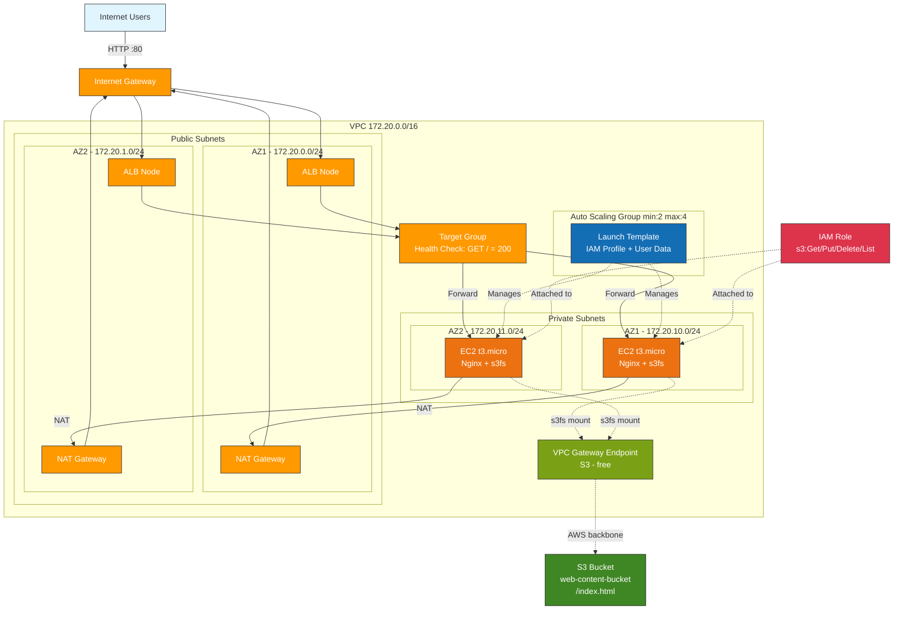
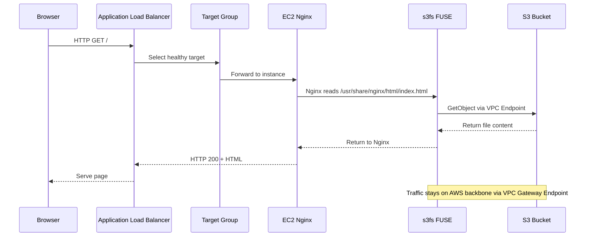
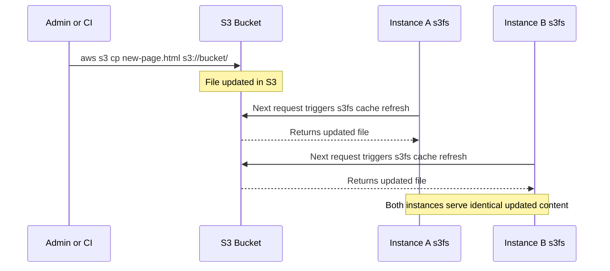
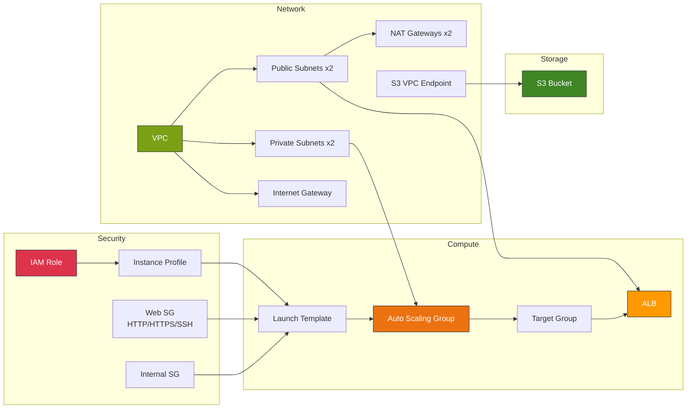
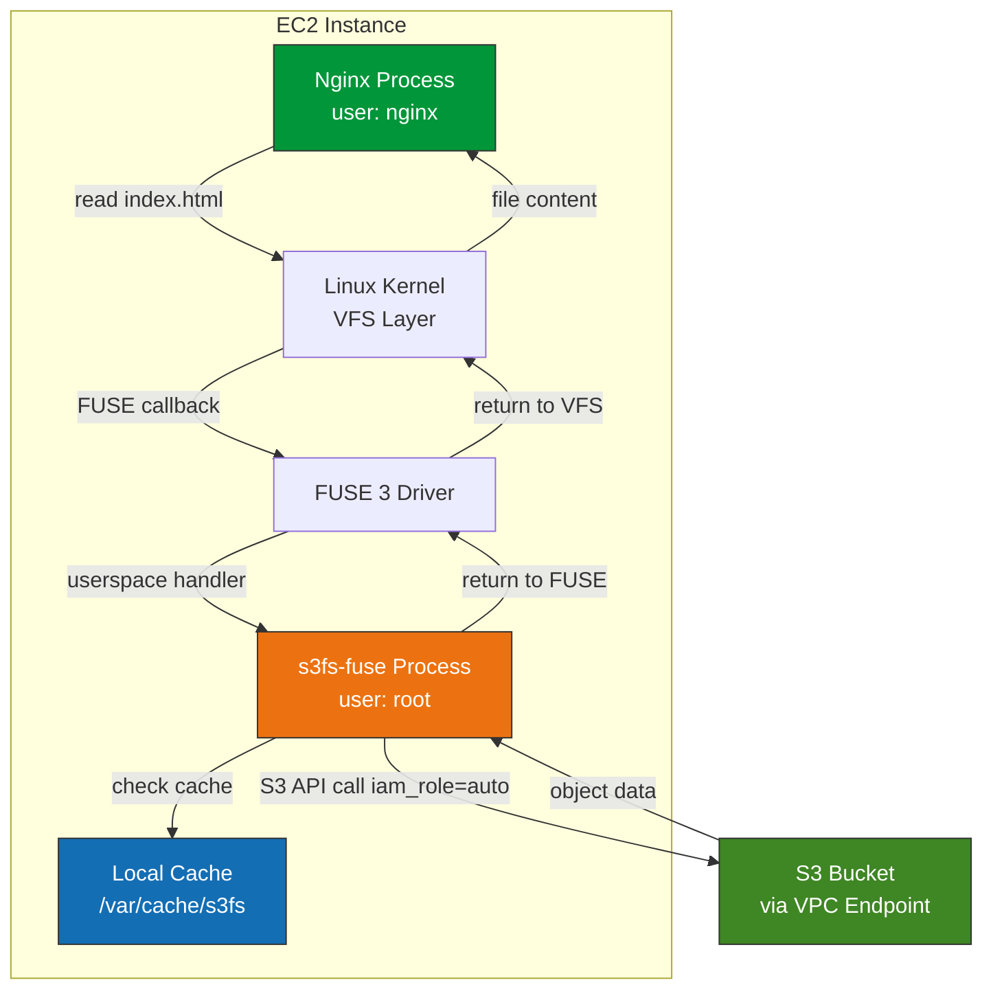
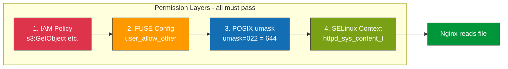
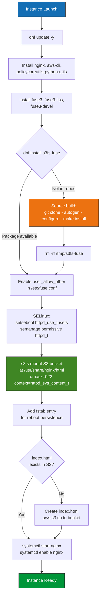
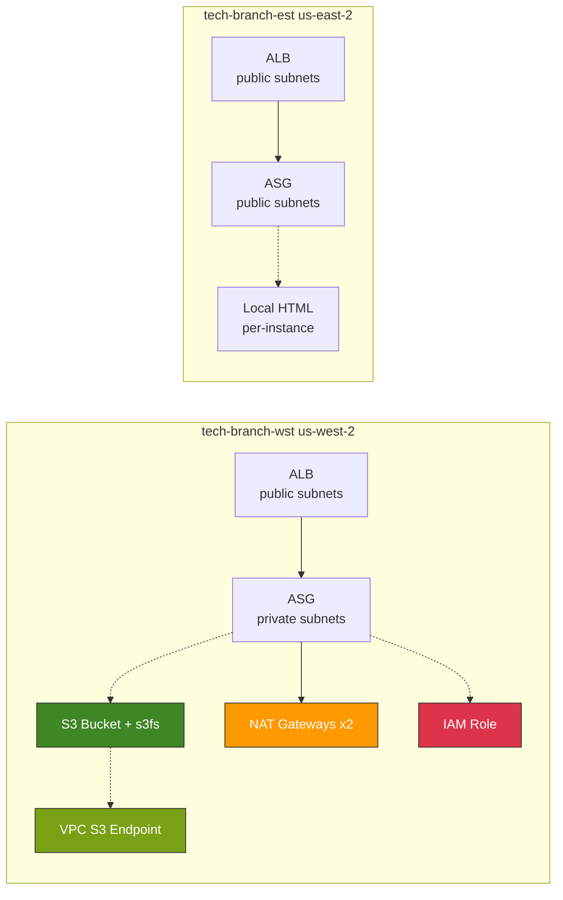
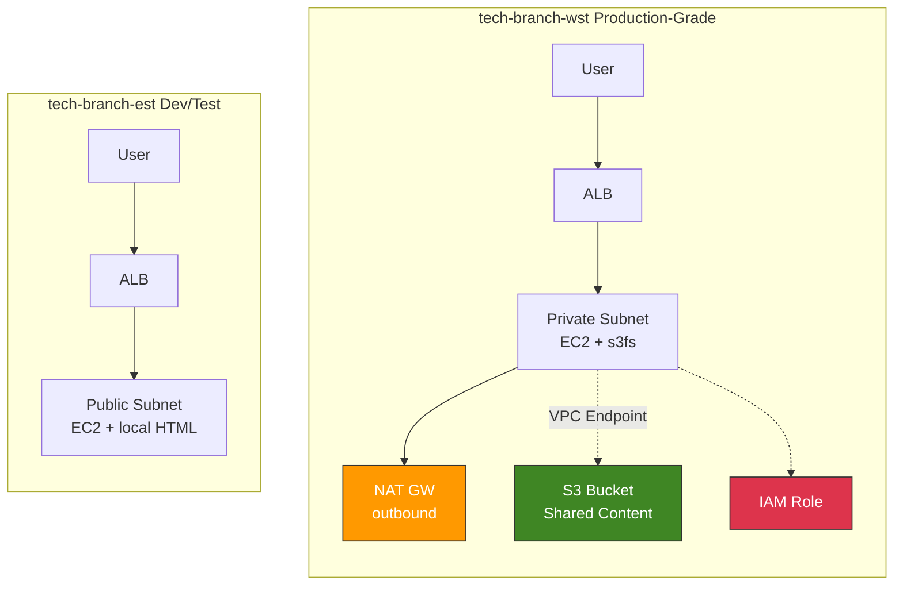

# tech-branch-wst Deployment Guide

> **Viewing Diagrams**: This guide contains Mermaid diagrams. View on GitHub, GitLab, or in VS Code Markdown Preview (Ctrl+Shift+V) with the [Markdown Mermaid](https://marketplace.visualstudio.com/items?itemName=bierner.markdown-mermaid) extension.

## Table of Contents

1. [Architecture Overview](#architecture-overview)
2. [Architecture Diagram](#architecture-diagram)
3. [Data Flow](#data-flow)
4. [Infrastructure Components](#infrastructure-components)
5. [S3 Shared Storage Architecture](#s3-shared-storage-architecture)
6. [User Data Bootstrap Sequence](#user-data-bootstrap-sequence)
7. [Configuration](#configuration)
8. [Deployment Steps](#deployment-steps)
9. [Operations](#operations)
10. [Branch Comparison: tech-branch-wst vs tech-branch-est](#branch-comparison)
11. [Troubleshooting](#troubleshooting)
12. [Cost Estimation](#cost-estimation)

---

## Architecture Overview

tech-branch-wst deploys a production-grade, highly available web tier on AWS with **shared S3 storage** for consistent content across all instances. Unlike a basic deployment where each instance has its own local content, all instances mount the same S3 bucket via s3fs-fuse, ensuring content changes propagate to every server automatically.

### Key Design Decisions

| Decision | Choice | Rationale |
|----------|--------|-----------|
| Instance placement | Private subnets | No direct internet exposure; ALB handles inbound traffic |
| Internet access | NAT Gateway (per AZ) | Instances need outbound for package installs and updates |
| Content storage | S3 + s3fs mount | Shared state across all ASG instances; survives instance termination |
| S3 access path | VPC Gateway Endpoint | Free; keeps S3 traffic on AWS backbone (no NAT charges) |
| Authentication | IAM Instance Profile | No access keys on disk; automatic credential rotation |
| SELinux | Permissive for httpd_t + context mount | AL2023 enforces SELinux; FUSE mounts need explicit labels |

---

## Architecture Diagram



---

## Data Flow

### Request Flow (User to Content)



### S3 Content Update Flow



---

## Infrastructure Components

### Resource Map



### Component Details

| Component | Resource | Details |
|-----------|----------|---------|
| **VPC** | `172.20.0.0/16` | DNS hostnames + DNS support enabled |
| **Public Subnets** | `172.20.0.0/24`, `172.20.1.0/24` | ALB + NAT Gateways; auto-assign public IPs |
| **Private Subnets** | `172.20.10.0/24`, `172.20.11.0/24` | EC2 instances; no public IPs |
| **NAT Gateways** | 1 per AZ | Elastic IP attached; outbound internet for private subnets |
| **VPC Endpoint** | Gateway type for S3 | Free; associated with all route tables |
| **S3 Bucket** | `tech-branch-wst-dev-web-content-bucket` | Shared content store; mounted at `/usr/share/nginx/html` |
| **IAM Role** | EC2 assume-role | `s3:ListBucket`, `s3:GetObject`, `s3:PutObject`, `s3:DeleteObject` |
| **Launch Template** | t3.micro, 30GB gp3 | Encrypted EBS, detailed monitoring, user data with s3fs |
| **Target Group** | HTTP :80 | Health check `GET /` every 30s, expects 200 |
| **ALB** | Internet-facing, HTTP :80 | Multi-AZ across public subnets; HTTP/2 enabled |
| **ASG** | min:2, max:4, desired:2 | ELB health checks; 300s grace period |

---

## S3 Shared Storage Architecture

### How s3fs-fuse Works



### Mount Configuration

| Option | Value | Purpose |
|--------|-------|---------|
| `iam_role=auto` | EC2 metadata | No access keys; uses instance profile credentials |
| `allow_other` | enabled | Lets nginx (non-root) access the mount |
| `umask=022` | files: 644, dirs: 755 | nginx user can read all files |
| `use_cache` | `/var/cache/s3fs` | EBS-backed cache (not tmpfs) |
| `ensure_diskfree` | 100 MB | Minimum free space before cache eviction |
| `context=` | `httpd_sys_content_t` | SELinux label for nginx access |
| `url` | `https://s3.us-west-2.amazonaws.com` | Regional S3 endpoint |

### Permission Layers



---

## User Data Bootstrap Sequence



---

## Configuration

### Pulumi.dev.yaml

```yaml
config:
  aws:region: us-west-2
  aws:profile: default
  env: dev
  branch: tech-branch-wst
  vpc:
    cidrBlock: "172.20.0.0/16"
    enableNatGateway: true        # Required for private subnet internet access
    enableDnsHostnames: true
    enableDnsSupport: true
  ec2:
    instanceType: t3.micro
    desiredCapacity: 2
    minSize: 2
    maxSize: 4
    volumeSize: 30                # Minimum 30GB for AL2023 AMI
    volumeType: gp3
    deleteOnTermination: true
    encrypted: true
```

---

## Deployment Steps

```bash
# 1. Navigate to branch directory
cd pulumi-python-projects/deploy-asg/branch/tech-branch-wst

# 2. Activate virtual environment
source ../../venv/bin/activate
pip install -r ../../requirements.txt

# 3. Login and select stack
pulumi login
pulumi stack select dev

# 4. Preview and deploy
pulumi preview
pulumi up

# 5. Verify
pulumi stack output application_url
curl $(pulumi stack output alb_dns_name)
```

**Expected deployment time**: 5-8 minutes (NAT Gateways take ~2 min each)

### Updating Content

```bash
# Upload new content directly to S3
aws s3 cp new-page.html s3://$(pulumi stack output content_bucket_name)/index.html

# All instances serve the updated content automatically (after s3fs cache refresh)
```

### Rolling Instance Updates

```bash
# After changing user data in __main__.py:
pulumi up

# Trigger instance refresh to replace running instances
aws autoscaling start-instance-refresh \
  --auto-scaling-group-name $(pulumi stack output asg_name) \
  --region us-west-2
```

---

## Operations

### Debugging Instance Issues

```bash
# Check target health
aws elbv2 describe-target-health \
  --target-group-arn $(pulumi stack output target_group_arn) \
  --region us-west-2

# Check instance refresh status
aws autoscaling describe-instance-refreshes \
  --auto-scaling-group-name $(pulumi stack output asg_name) \
  --region us-west-2

# SSH to instance (via bastion or SSM) and check cloud-init log
cat /var/log/cloud-init-output.log

# Verify s3fs mount
mount | grep s3fs
ls -laZ /usr/share/nginx/html/

# Check nginx
systemctl status nginx
curl localhost
cat /var/log/nginx/error.log | tail -20
```

---

## Branch Comparison

### tech-branch-wst vs tech-branch-est



### Feature Comparison

| Feature | tech-branch-wst | tech-branch-est |
|---------|----------------|----------------|
| **Region** | us-west-2 | us-east-2 |
| **VPC CIDR** | 172.20.0.0/16 | 172.30.0.0/16 |
| **Instance Placement** | Private subnets | Public subnets |
| **NAT Gateway** | Enabled (1 per AZ) | Disabled |
| **S3 Bucket** | Shared content store | None |
| **s3fs Mount** | /usr/share/nginx/html | None |
| **IAM Instance Profile** | S3 read/write access | None |
| **VPC Endpoint (S3)** | Gateway endpoint (free) | None |
| **Content Source** | S3 bucket (shared) | Local filesystem (per-instance) |
| **Content Persistence** | Survives instance termination | Lost on termination |
| **Content Updates** | `aws s3 cp` — all instances update | Must redeploy instances |
| **EBS Volume Size** | 30 GB (gp3) | 20 GB (gp3) |
| **SELinux Config** | Managed (context + permissive) | None needed |
| **User Data Complexity** | ~120 lines (s3fs + FUSE + SELinux) | ~20 lines (nginx only) |
| **Security Posture** | Higher (no public IPs on instances) | Lower (instances have public IPs) |
| **Monthly Cost** | ~$105 (includes NAT + S3) | ~$39 (compute + ALB only) |

### Architecture Comparison Diagram



### When to Use Each

**tech-branch-wst** (production-grade):
- Content must be consistent across all instances
- Instances should not have public IPs
- Content updates without redeployment
- Data must survive instance termination
- Compliance requires S3 traffic stays on AWS network

**tech-branch-est** (dev/test):
- Quick iteration and testing
- Cost-sensitive environments
- Static content that rarely changes
- No compliance requirements for network isolation

---

## Troubleshooting

Refer to [memory/errors.md](../../memory/errors.md) for a complete log of all errors encountered during development and their fixes. Key issues and solutions:

| Error | Root Cause | Fix |
|-------|-----------|-----|
| InvalidSubnet.Range | Subnet CIDRs outside VPC range | Derive CIDRs from VPC CIDR |
| Volume size < 30GB | AL2023 AMI needs >= 30GB | Set volumeSize: 30 |
| FUSE 3 not found | Wrong packages (fuse2 vs fuse3) | Install fuse3, fuse3-libs, fuse3-devel |
| Config values ignored | Wrong Pulumi Config namespace | Use config.get_object() for nested YAML |
| Disk space for cache | /tmp is tmpfs on AL2023 | Cache on /var/cache/s3fs (EBS) |
| Unknown option nonempty | FUSE 3 removed -o nonempty | Remove the option (default in FUSE 3) |
| 403 Forbidden (SELinux) | SELinux blocks nginx from FUSE | context=httpd_sys_content_t on mount |
| 403 Forbidden (permissions) | mp_umask only affects mount point | Use umask=022 for all files |

---

## Cost Estimation

### Monthly Cost Breakdown (us-west-2)

| Resource | Quantity | Unit Cost | Monthly Cost |
|----------|----------|-----------|--------------|
| EC2 t3.micro | 2 instances | $0.0104/hr | ~$15.00 |
| EBS gp3 30GB | 2 volumes | $0.08/GB-mo | $4.80 |
| NAT Gateway | 2 (per AZ) | $32.40/mo each | $64.80 |
| NAT Data Processing | ~10 GB | $0.045/GB | $0.45 |
| ALB | 1 | $16.20 + LCU | ~$20.00 |
| S3 Storage | < 1 GB | $0.023/GB | ~$0.01 |
| S3 Requests | ~10k/mo | $0.005/1k | ~$0.05 |
| VPC Endpoint (Gateway) | 1 | Free | $0.00 |
| Data Transfer | ~10 GB | $0.09/GB | $0.90 |
| **Total** | | | **~$106/month** |

> NAT Gateways are the largest cost. For dev environments, consider disabling them and placing instances in public subnets (like tech-branch-est) to save ~$65/month.

---

*Last Updated: 2026-02-06*
